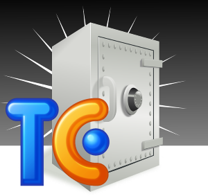

# TeamCity Backup



[](https://ci.appveyor.com/project/FantasticFiasco/teamcity-backup/branch/master)

## The Elevator Pitch

If you are using [TeamCity from JetBrains](https://www.jetbrains.com/teamcity/), are you sure that you continuously are backing up all your projects and their settings?

If not, perhaps I can help you?

What if I told you that you can run the backup process as any other project within TeamCity. By dogfooding the backup to TeamCity, all information is kept within the same system, and the backup history is as clearly visualized as your continuous deliveries.

Pretty smart huh?

## Configuration

I've created a small console application that is capable of triggering TeamCity to perform a backup by means of using the [official REST API](https://confluence.jetbrains.com/display/TCD8/REST+API#RESTAPI-DataBackup).

Lets take a look at the options you have for performing a backup.

```dos
C:\>TeamCityBackup.exe /?
TeamCity Backup  version 1.0.3.0
Copyright © FantasticFiasco 2014-2016

Usage:
   TeamCityBackup /server=url /username=value /password=value
     [/backupdir=dir] [/filename=file] [/maxbackupcount=value]
     [/addtimestamp=true|false] [/includeconfigs=true|false]
     [/includedatabase=true|false] [/includebuildlogs=true|false]
     [/includepersonalchanges=true|false]

Options:
   /?, /h, /help                Displays this help text.
   /addtimestamp                Whether backup file name should be suffixed
                                with a timestamp. Default value is true.
   /backupdir                   The directory where backups are
                                stored. Specify this property if you
                                wish to make sure that the number of
                                backups doesn't exceed maxbackupcount.
   /filename, /f                The prefix of the backup file name.
                                The default value is 'TeamCity_Backup'.
   /includebuildlogs            Whether to include build
                                logs. Default value is true.
   /includeconfigs              Whether to include configuration.
                                Default value is true.
   /includedatabase             Whether to include database.
                                Default value is true.
   /includepersonalchanges      Whether to include personal
                                changes. Default value is true.
   /maxbackupcount              The maximum number of backups stored at the
                                backup directory. The default value is 10.
   /password, /p                The password of the TeamCity administrator.
   /server, /s                  The address of the TeamCity server.
   /username, /u                The username of the TeamCity administrator.

```

Out of these options only three are mandatory:

- __server__ - The address of the TeamCity server
- __username__ - The username of the TeamCity administrator
- __password__ - The password of the TeamCity administrator

## Basic Example

Here is a basic example of a command that would perform a backup of a TeamCity server located on *www.myteamcityserver.com* using the credentials of the TeamCity administrator *teamcity_user*.

```dos
C:\>TeamCityBackup.exe /server=www.myteamcityserver.com /username=teamcity_user /password=password
```
